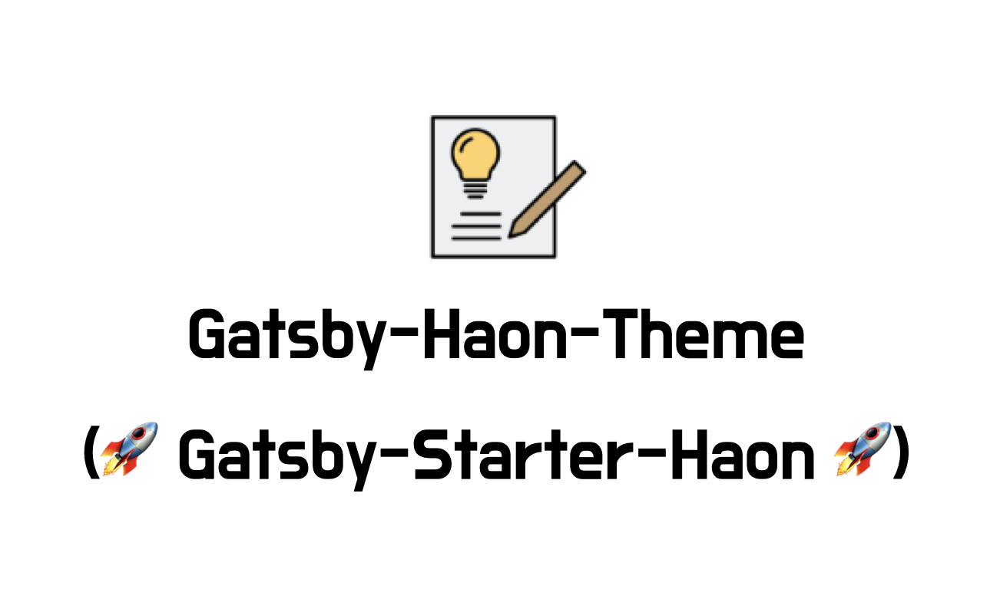
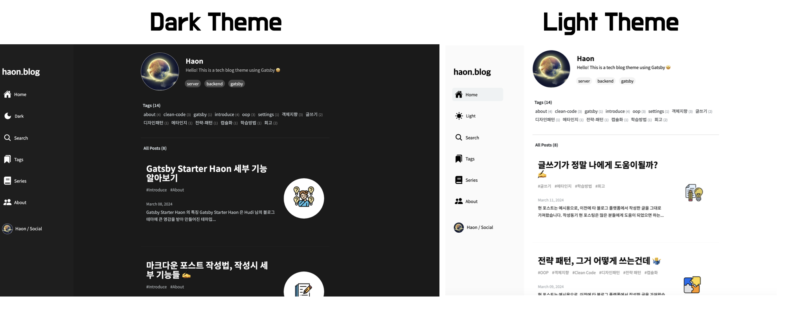

# <div align="center">Gatsby Starter Haon (Blog Theme - Open Source) 🚀</div>

> 💡 All the code in this repository and the blog theme are **open source.** Therefore, feel free to clone and use it as you wish! 🙂
>
> - (현 블로그 테마는 오픈소스입니다. 자유롭게 clone 받아 커스터마이징하여 블로그를 꾸며보세요 🙂)


- Blog Theme Live Demo: https://gatsby-starter-haon.netlify.app/
- 국문(한국어 원서) 은 [Gatsby 블로그 초기 설정 ⚙️ 가이드라인](https://gatsby-starter-haon.netlify.app/how-to-use/initial-settings-kr/) 에서 부터 확인 가능합니다.



I hope this theme will be helpful for those who want to customize and operate your blogs. Feel free to customize and use the Gatsby Haon Theme! 👋 I drew great inspiration for creating this theme from [Hudi's blog](https://github.com/devHudi/gatsby-starter-hoodie).



---

## Features 🚀

- Markdown
- SEO
- Responsive Web
- Dark/Light Mode
- Tag
- Series
- Search
- Private Mode
- Utterance (Comment widget)
- GA (Google Analytics)

---

## 0. Create a GitHub Repository

Before installing the theme, you need a GitHub repository for your Gatsby Theme. Please create one.

---

## 1. Installing the Theme 👋

Follow the steps below to create your own blog theme!

```
npx gatsby new your-blog-name https://github.com/msung99/Gatsby-Starter-Haon.git
```

---

## 2. Running Gatsby Local Server

Once you have downloaded the theme to your local machine, follow the steps below to run the Gatsby local server.

```
cd your-blog-name
npm install  // install node.js
gatsby develop // or "npm start"
```

If the above commands run without any issues, you can check the initial state of your blog at http://localhost:8000!

---

## 3. Entering Blog Information

You can directly input your meta information to customize the theme. If you navigate to `gatsby-config.js`, you will see the initial state as follows:

```js
module.exports = {
  siteMetadata: {
    title: `haon.blog`,
    description: `Hello! This is a tech blog theme using Gatsby 🤩`,
    author: `Haon`,
    siteUrl: `https://gatsby-starter-haon.netlify.app/`,
    keywords: [`server`, `backend`, `gatsby`],
    repo: "msung99/Gatsby-Starter-Haon",
    socialLinks: {
      github: "https://github.com/msung99",
      instagram: "https://www.instagram.com/iminseong920",
      facebook: "https://www.facebook.com/",
      linkedin: "https://www.linkedin.com/",
      velog: "https://velog.io/@msung99",
      email: `https://msung6924@naver.com`,
    },
  },
  plugins: [
    // ... (omitted)
  ],
}
```

Modify the `siteMetadata` as follows:

### 3-1. Basic Profile Settings

Input your basic profile information.

```
title: ``, // haon.blog
description: ``, // Hello! This is a tech blog theme using Gatsby 🤩
author: ``, // Haon
siteUrl: ``, // https://gatsby-starter-haon.netlify.app/
keywords: [ ], // [`server`, `backend`, `gatsby`]
```

### 3-2. Utterances (Comments) Configuration

This template is based on the issue creation-based comment system. Input your GitHub repository information for smooth comment functionality activation.

```
repo: "your-github-name/repository-name"  //  "msung99/Gatsby-Starter-Haon",
```

### 3-3. Social Links Integration

Lastly, you can integrate your social media accounts. This is required for the feature where clicking on social icons navigates to the respective URLs. Customize the desired fields from the below social accounts:

```
socialLinks: {
  github: ""  // "https://github.com/msung99",
  instagram: ""  // "https://www.instagram.com/iminseong920",
  facebook: ""  // "https://www.facebook.com/",
  linkedin: ""  // "https://www.linkedin.com/",
  velog: ""  // "https://velog.io/@msung99",
  email: ""  // `https://msung6924@naver.com`,
},
```

---

## 4. Deploying the Blog

You can quickly create your blog on `Github Page` or `Netlify`, depending on your preferred deployment environment. Here, I'll briefly mention Netlify.

By utilizing the button below, you can integrate your GitHub repository with Netlify to deploy your blog. You may need your GitHub repository for this process, which you should have created earlier.

<a href="https://app.netlify.com/start/deploy?repository=https://github.com/msung99/Gatsby-Starter-Haon.git" target="_blank"></a>

---

## Issue, PR Registration

If you're using Gatsby-Starter-Haon and have something you want to communicate:

[Social Page](https://gatsby-starter-haon.netlify.app/community/) or [Register Issue](https://github.com/msung99/Gatsby-Starter-Haon/issues/1) and feel free to leave comments.

- Suggestions
- Q&A
- Bug Discovery and Code Improvement
- New Features / Functions

Feel free to leave comments or register issues according to the Issue Template.

We welcome any feedback. We're looking forward to many people's opinions for quality software improvement and theme development. 👍
