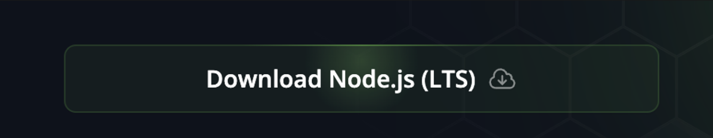
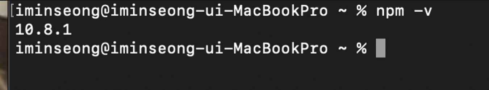
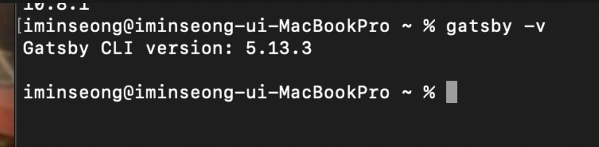

## 1. Install Node.js

Visit the [Node.js download page](https://nodejs.org/en) and install Node.js. Click the button on the site to start the installation.


    
After the installation is complete, open your terminal and type the command `npm -v`. 
If the Node.js version appears in the terminal, it means the installation was successful. (Note: Your Node.js version does not need to match mine exactly!)



---

## 2. Install Gatsby CLI

Type the following command in the terminal to automatically install Gatsby CLI. Once you have completed the installation of Gatsby CLI, you are done with all the installations.

```jsx
npm install -g gatsby-cli
```

Similarly, after the installation, type the command `gatsby -v` to verify that the Gatsby CLI version is displayed correctly.
    
    

---

## Next Steps

For the next steps, refer to the post [Gatsby Blog Initial Settings ⚙️](https://gatsby-starter-haon.netlify.app/how-to-use/initial-settings-kr/).

