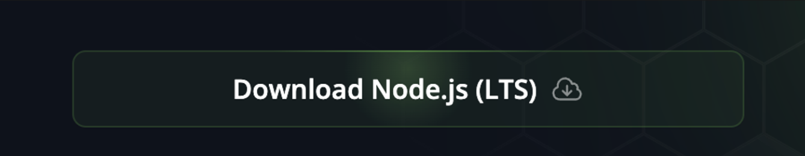
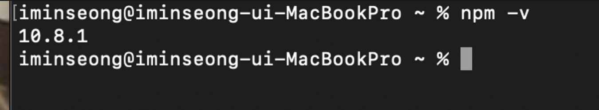
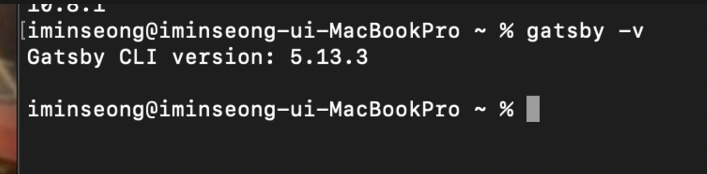

## 1. Node.js 설치

[Node.js 설치 링크](https://nodejs.org/en) 에 접속하여 Node.js 를 설치해주세요. 위 사이트에서 아래 버튼 누르면 설치가 시작됩니다.
    

    
설치 완료 후, 터미널에서 `npm -v` 명령어를 입력해주세요. 
아래와 같이 node.js 버전이 터미널에 표시되면 정상적으로 설치된겁니다. (참고로 node.js 버전이 저랑 완전히 똑같을 필요 없습니다!)




---

## 2. Gatsby Cli 설치

아래 명령어를 터미널에서 입력해주세요. 그러면 자동으로 Gatsby Cli 가 설치됩니다. Gatsby Cli 까지 설치를 완료했다면 모든 설치는 끝입니다.

```jsx
npm install -g gatsby-cli
```

마찬가지로, 설치 후 `gatsby -v` 명령어를 입력해서 Gatsby Cli 도 버전이 잘 표시되는지 확인해주세요.
    
    

---
 
## 이어서

이어지는 내용은 [Gatsby 블로그 초기 설정 ⚙️](https://gatsby-starter-haon.netlify.app/how-to-use/initial-settings-kr/) 포스트를 참고해주세요.