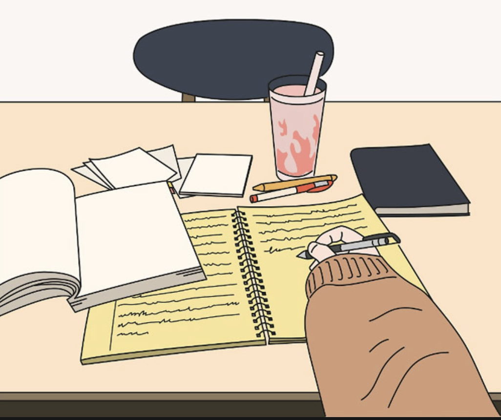
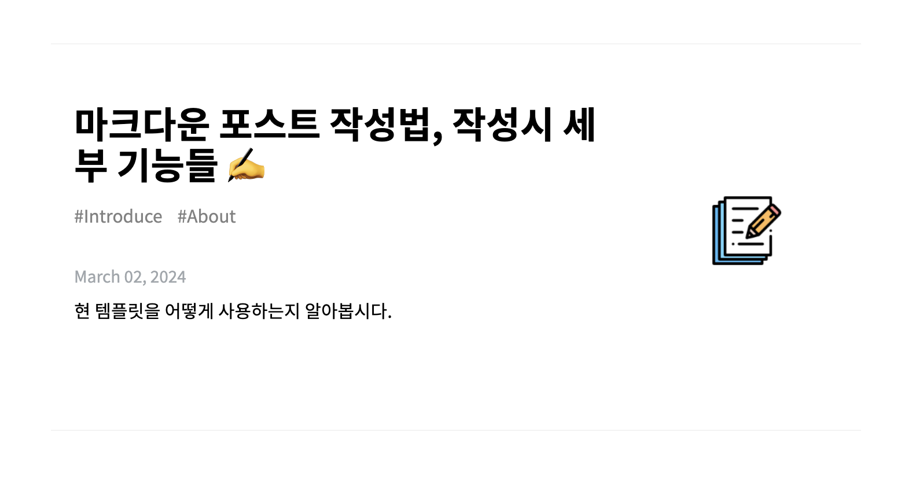

## 1. Markdown Based

This template is based on Markdown. To write a post, create a directory under `/contents/posts` and write the post in Markdown format.

For example, create a directory called `how-to-use` under `/contents/posts` and write the post in an `index.md` file. In this case, the URL of the post will be `http(s)://your-domain/how-to-use`.

#### 인라인 모드

$$
S_n = \frac{n(2a + (n-1)d)}{2}
$$

$a^2 + b^2 = c^2$


$$E = m c^{2}$$

#### 블럭 모드

$$
\int_{0}^{\infty} f(x) dx
$$

---

## 2. Meta Information

Once you create the Markdown file, you must enter the meta information for the post. The required information is as follows.

```
---
title: How to Write Markdown Posts and Detailed Features
description: Let's learn how to use this template.
date: "2024-03-02"
tags:
  - Introduce
  - About
series: how to use this template?
// isPrivate: true
---
```

The explanations for each meta information are as follows:

- `title` : Title of the post
- `description` : Summary of the post. Optional.
- `date` : Posting date
- `tags` : List of tags
- `series` : Series (similar to the category concept)
- `isPrivate` : Privacy setting. If you want to make the post private, set "isPrivate: true".

---

## 3. Adding Images to the Post

To add an image to a post, use the following format. Note that the image should be located in the same folder as the Markdown file.

```

```

Here is an example of adding an image named `image1.png`.



---

## 4. Supports Code Highlight

You can create code blocks in posts. Below is a code block written in the Java programming language.

```java
public String getLines(){
  StringBuilder stringBuilder = new StringBuilder();
  repeatPrint(stringBuilder);
  return stringBuilder.toString();
}

private void repeatRows(StringBuilder stringBuilder){
  for(int i=0; i<10; i++){
    repeatRow(stringBuilder);
    stringBuilder.append("two");
  }
}

private void repeatRow(StringBuilder stringBuilder){
  for(int i=0; i<5; i++){
    stringBuilder.append("one");
  }
}
```

---

## 5. Post Preview Image (Thumbnail)

The post preview feature is also available, similar to thumbnails.

### 5-1. Adding a Preview Image

The path for adding a preview image is slightly different from the path for adding an image within the post. While the image for the post should be in the same folder as the Markdown file, the preview thumbnail image should be added in the `static` folder.

If you have placed a preview image named `writing.png` in the static folder, the post will be displayed as follows.



Feel free to customize your preview!

### 5-2. Default Preview Image (default.png)

If no preview image is added, the default image `default.png` will be displayed as the preview. `default.png` is located in the static folder. If you want to customize it, feel free to modify the `default.png` image.

---

## 6. Toc (Table of Contents)


You can see the table of contents feature in the upper right corner of the post. The text generated in the table of contents is based on the titles in h1, h2, and h3 tags.

---

## 7. Feature Summary

To summarize the post features:

- `Markdown`
- `Tags`
- `Series`
- `Share` (Sharing feature: copy post link / share on Facebook / share on Twitter)
- `Private mode` (post public / private)
- `Toc`
