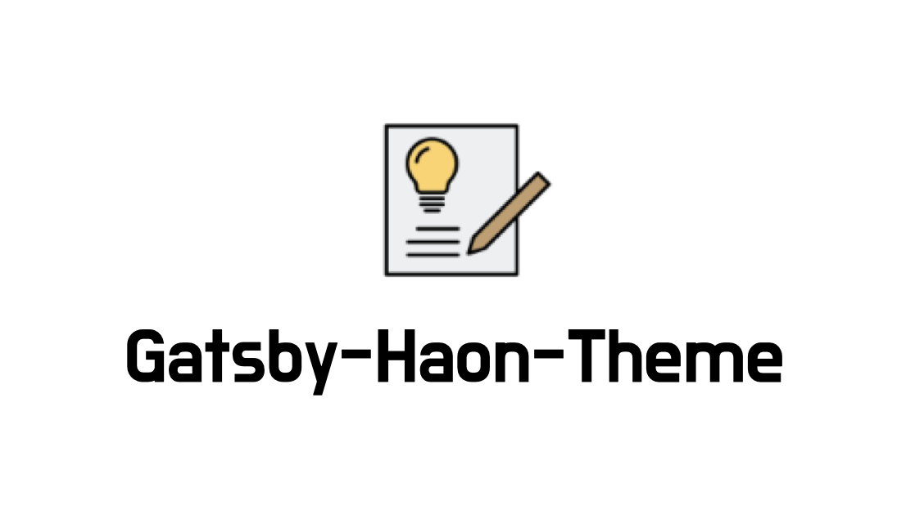
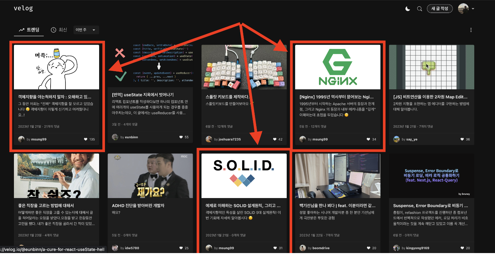

> 💡 현 포스트는 about 페이지에서도 조회 가능합니다. 포스트를 삭제하지 말고, 이 곳에다 본인만의 멋진 소개 글을 작성해주세요.

## 1. 내 소개, 블로깅 경험

나는 인하대학교 컴퓨터공학과에 재학중인 백엔드 개발자 이민성이다. 웹 프로그래밍을 처음 접한지는 거의 2년 가까이 되었으며, 스프링부트 프레임워크로 본격적인 백엔드 개발을 시작한지는 1년 반 정도 된 듯 하다. 개발자 온라인 커뮤니티 내에서는 `Haon` 이라는 글로벌 네임을 사용하고 있다. 이는 작년에 MAU 기준 약 5,000명의 유저가 있는 사이드 프로젝트에 참여하면서 팀원들과 존칭, 소통 문화를 갖추어갈때 만든 닉네임이다.

### 글쓰기 ✍️

나는 고등학생 때 부터 글쓰기를 정말 좋아했다. 프로그래밍은 몰론, 글쓰기 대회에 참여하며 소소하게 수상을 한적도 많았다. ( 글쓰기 대회 수상만 30개가 넘으니 🤔 ) 담임 선생님과 친구들이 내가 쓴 글을 읽고 좋아해주는 모습에 큰 보람을 느꼈고, 이 습관은 자연스레 대학교에 진학한 이후에도 이어지는 듯 하다.

17살 어릴때 프로그래밍을 처음 접했고, 비교적 남들보다 빠른 시기에 프로그래밍을 시작했다. 하지만 아쉽게도 웹 프로그래밍을 접한 시기는 대학교에 진학한 이후부터다. 웹 프로그래밍을 본격적으로 시작하며, 처음 글쓰기를 시작한 플랫폼은 `네이버 블로그`다. 네이버 블로그를 사용하다 사용에 불편함을 느낀것이 너무 많았기에 2022년 부터 개발자 글쓰기 `velog` 로 이전했다. velog 에서도 꾸준히 [Haon](https://velog.io/@msung99/posts) 이라는 닉네임으로 활동하며 많은 분들에게 긍정적인 영향력을 끼칠 수 있었다. 운이 좋게도 작성한 글들이 트랜드 상위권에 올라갔던 적이 꽤 있었다.

### 타 플랫폼에서 불편함을 느끼기 시작했다.

여러 플랫폼들을 돌아다니며 각 플랫폼마다 내 만족도를 100% 채울 수 있는것엔 한계가 있었다. 10가지 디자인, 기능이 있다하면 7 ~ 8개가 너무 좋아서 마음에 들어서 꾸준히 글을 작성했지만, 아쉽게도 나머지 2 ~ 3개가 내 만족도를 높여줄 수가 없었다.

---

## 2. 나만의 블로그 개발 시작 🚀

### 내가 직접 블로그를 만들자.

언젠간 꼭 나만의 블로그를 만들고 싶었다. 너무 만들고 싶었다. 17살 어린 시절부터 프로그래밍은 몰론 글쓰기를 너무 좋아하기도 했고, 현재까지도 꾸준히 글을 쓰고있으니, 만들지않을 이유가 없었다. 다만 아래와 같은 마인드가 지금까지 블로그 개발 시기를 꽤 늦추었다.

> **블로그 개발을 망설이게 했던 잘못된 가치관들**
>
> - 백엔드 개발자인데 감히 프론트엔드 개발을 하는게 맞을까?
> - 프론트엔드를 학습하고 개발하지 하려면 정말 많은 시간이 소요되지 않을까? 반년은 훨씬 넘게 걸릴 것 같아.
> - 이미 유명한 플랫폼들이 넘쳐나는데, 내가 뭐라고 감히 개성 넘치는 블로그를 만들 수 있겠나.
> - 다른 사람들이 "하지마. 그걸 왜 개발해" 라고 한다. 그러니깐 하면 안되겠지?

난 "서버 개발자" 이니까. 라는 생각이 몇년간 개발을 지연시켰다. **무엇보다 주변 사람들의 내 판단, 생각이 잘못되었다는 지적이 날 가장 망설이게했다.** 결국 생각만 하고 행동으로 옮기지 못한체 상상 속에만 묻혀진 서비스 아이디어였다. (뭐, 나쁘게 말하면 줏대없고 타인에게 휘둘리는 삶을 살고 있었던게 아닐까 🤔)

하지만 연말에 개인적인 회고를 통해 다음과 같은 가치관을 만들었다.

> **블로그를 개발하기전에 생각한 가치관**
>
> - 프론트엔드 학습과 블로그 개발 기간이 6달 정도나 오래걸리는게 마음게 걸린다면, 1~2달로 줄이면 되는거 아닌가?
> - 타인의 의견에 휘둘려선 안된다. 나만의 색깔과 개성을 찾아가자.
> - 모두가 온전히 동일한 삶을 살고있는것이 아니기에, 내 자신만이 내 상황을 잘 이해할 수 있고 판단할 수 있다. 당연히 의사결정도 내가 해야한다.

무엇보다 값진 배움은 타인에게 휘둘리는 삶을 살면 안된다는 것이다. **그걸 왜 해? 하지마.** 라는 타인의 의견, 시선으로 부터 벗어나니 이렇게 블로그 테마를 완성할 수 있었다.

### 1달에 걸쳐 개발한 Gatsby Haon Theme, 힘들었던 여정

`Gatsby Haon Theme` 블로그는 약 1달에 걸쳐 만들어낸 플랫폼이다. 올해 1월부터 html, css, js, react.js 를 독학하기 시작했고, 2월부터 약 1달에 걸쳐 만들어냈다. 백엔드만을 집요하게 공부했지, 프론트엔드를 학습한 경험이 없었다.

서비스를 개발하면서 많은 어려움이 있었고, 그에서 많은 배움을 얻었다. 기술적인 트러블슈팅에서도 몰론 배움이 있었지만, 이 보단 가치관에 많은 변화가 있었다. 우선 프론트엔드를 처음 접한 **내가 1달만에 플랫폼을 만들어낼 수 있을까? 라는 질문. 그리고 미래에 대한 불확실성**은 불안함으로 이어졌다. 이 테마를 제작하면서 불안, 초조함을 다스리는 나만의 방법도 만들었다.

**무엇보다 가장 큰 배움은 타인에게 휘둘리지 않고, 나만의 색깔을 찾아가는 방법을 배웠다.** 비슷한 맥락으로, 최근부터 내가 실천하는 행위에 비난하는 제 3자와의 심적 거리를 두기 사작했다. 내 의견, 행위에 방해하는 사람들과 거리를 둔다는것이 아니다. 현명한 조언자가 나타나 내게 말을 내뱉으면 거리를 둔 다는것이 아니다.

---

## 3. 블로그를 제작하는데 도움을 받은 타 플랫폼

`Gatsby Haon Theme` 를 제작하는데 많은 블로그 플랫폼들을 참고하면서 만들어냈다. 여러 플랫폼 중 가장 도움을 받았던 몇가지에 대해서 소개하고자 한다.

### Hudi.blog

[hudi.blog](https://hudi.blog/) : **가장 많이 참고했던 Hudi 님의 블로그다.**
평소 많은 배움을 안겨준 지인이기도 하다.
다크/라이트 컬러를 베이스로 차분함을 유지하며, 깔끔한 블로그 디자인에서 큰 영감을 얻고 참고하며 개발했다.
동일하게 Gatsby 기반으로 만들었다.

### Velog

[Velog](https://velog.io/) : 이전까지 사용했던 Velog 플랫폼이다. Velog 의 Tag, Series
등의 장점을 그대로 살려 가져왔다. 향후 백엔드 개발까지 도입된다면, Velog 플랫폼과 같이 커뮤니티를 활성화해보는 것도 고민중이다 🤔

### junghyeonsu.dev

[junghyeonsu.dev](https://junghyeonsu.com/) : 참고할 블로그를 찾아보며 정현수님의 개인 블로그를 알게 되었다. TagList 및 기본 텍스트를 디자인하는데 도움을 받았다.

### Devsisters Tech Blog

[데브시스터즈](https://tech.devsisters.com/) 기술 블로그 : 포스트 리스트에 썸네일 이미지를 배치하는 방식이 심플하면서도 예뻤다. PostList 를 만드는데 도움을 받았다.

이 외에도 여러 다른 블로그 플랫폼과 프로젝트에서 많은 영감을 받았음을 밝힌다.
프론트엔드를 처음 접한 내가 Gatsby Theme 를 약 1달내로 만들게 해주었던 많은 분들에게 감사의 말씀을 드린다.

---

## 내게 있어 개발 블로그란, 운영 게획

어릴때부터 글쓰기는 내게 큰 동력이었다. 글쓰기는 블로그를 운영하게 해주었고, 이렇게 직접 블로그 개발까지 만들게 해주었다.
많은 사람들이 내 글을 읽고 도움을 받았을 때, 양질의 글을 읽고 감사하다고 표현했을 때 큰 뿌듯함과 벅차오름을 느꼈다. 이 감정은 꾸준히 공부할 수 있게 해주는 큰 활력이 되었다.
이전까지 운영했던 블로그에 방문해주신 많은 분들에게 감사를 표한다.

앞으로 블로그 운영 계획을 간략히 적어보겠다.

### 기존에 작성한 글들을 이전

기존에 Velog 에 작성했던 글들은 현 Gatsby Theme 를 따로 빌드하여 새롭게 블로그를 개설한 후 옮겨놓을 예정이다.
곧 글들을 새롭게 이전할 예정이니, 내 블로그에서 조만간 확인 가능하다.

### 많은 분들과 함께 Gatsby Theme 블로그를 발전시키자 💪

나는 앞서 말했듯이 프론트엔드가 전문 분야가 아니다. 이 테마에는 아직 찾지못한 버그, 개선사항들이 수두룩할 것이다.
아직 많이 부족하지만, 이 테마로 블로그를 개설하고 싶거나 함께 발전시켜볼 분들은 Issue 를 마음껏 등록해주길 바란다. PR 과 개인적인 문의 또한 당연히 대환영이다! 😆

### 백엔드 서버 연동, 커뮤니티성 블로그로 발전시키기

당장의 계획은 없지만, 앞서 말했듯이 백엔드 서버를 연동하여 커뮤니티를 발전해 볼 의향이 있다. 향후 생각이 생긴다면, 상황에 따라 발전시켜 보고자 한다.

---

## 마치며

기록과 경험 공유를 좋아하기에, 마침 글쓰기도 정말 좋아하기에 블로그를 개설했다. 내 블로그가 많은 분들에게 긍정적인 영향력을 줄 수 있을것이라고 믿는다.
또한 **현 블로그 테마를 사용하는 분들, 블로그에 방문해주시는 분들, 테마를 함께 더욱 발전시켜보고 싶은 분들과 많이 소통하고 싶다.**
각자가 가지고 있는 다양한 색깔을 만났을 때 양질의 소프트웨어로 발전할 수 있을것이다.
혹시 나와 같이 소통하고 싶은 사람이 있다면 언제든 편하게 소통할 수 있으면 좋겠다. 🙂

Gatsby-Starter-Haon 을 사용하다가 소통하고 싶은 내용이 생긴다면
[Social 페이지](https://gatsby-starter-haon.netlify.app/community/) 또는 [Issue 등록하기](https://github.com/msung99/Gatsby-Starter-Haon/issues/1) 에다 자유롭게 코멘트를 남겨주길 바란다!
