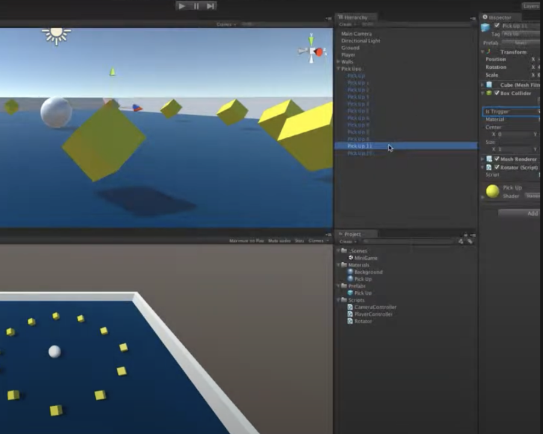
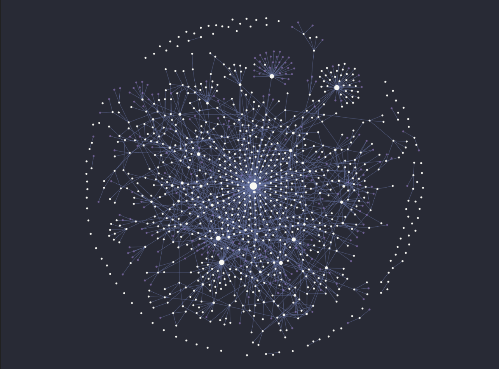

> 💡 현 포스트는 about 페이지에서도 조회 가능합니다. 포스트를 삭제하지 말고, 이 곳에다 본인만의 멋진 소개 글을 작성해주세요.

## 2015년 학창시절, 프로그래밍을 처음 접하다

내가 프로그래밍을 처음 접하게된 시절은 17살, 고등학교 1학년 시절이다. 지금도 한창 유행중인 압도적 1위 게임, `리그오브레전드` 를 즐겨왔다. 철없던 시절, 친구들과 PC방에 들러 랭크 게임전을 돌리고, 티어를 올리는데 열정을 다했다. 하라는 공부는 안하고. 😂

그떄부터 **나도 이런 게임을 한번 직접 만들어보고 싶다!** 라는 막연한 생각이 들었다. 게임을 직접 개발하기 위해선 프로그래밍을 학습해야 함을 알게 되었다. 그 당시부터 `Unity 3D`, `C#`, `C++` 으로 프로그래밍을 독학하기 시작했다. 유튜브에 공개된 Unity 3D 튜토리얼을 통해 기본 사용법, 프레임워크 툴 기본 사용법을 익히고, 부족한 부분이 생길때마다 그떄그때 이론 서적을 통해 보충하는 방식으로 게임을 만들어냈다.

내가 부족한 부분을 매꾸면서 얻어내는 성취감과 뿌듯함이 넘쳐났고, 새롭게 알아낸 사실들이 생겨날때마다 더 빨리 공부하고 싶었다. 특히 학창시절에 가장 기억에 남는 활동 중 하나가 `OBB(Oriented Bounding Box) 분리 초평면 이론` 에 관해 며칠간 밤을 세우며 공부하고, 레포트를 작성했을 때다. 내가 만들고 싶은 서비스, 게임을 직접 개발하면서 그때그때 부족한 부분이 무엇인지 깨닫고, 보완이 필요한 부분을 보충하고, 더 공부하고 싶은 내용을 매꾸면서 성장해왔다. **학창시절떄 프로그래밍을 학습했을 때를 떠올리면, 만들고 싶은 서비스를 떠올리고, 일단 부딪힌 후 부족한 부분을 필요할 때 마다 이론을 보충하는 방식으로 학습해왔다.**

---

## 하지만, 대학교 진학 후

프로그래밍의 매력에 빠져 대학교 전공도 컴퓨터공학과를 선택했다. 고민할 필요도 전혀 없었다. 대학도 남들 못지않게 괜찮은 대학교로 입학하게 되었다. 그런데 대학교의 모든 수업 내용들은 연구와 이론 중심으로 구성되었다. 교육을 이수하던 나는 자연스레 `이론 중심의 학습방향`을 갖게 되었고, 이전과 달리 내가 배우는 이론들이 어디에 어떻게 쓰이는지 알 수 없었다. 주입식 교육방식은 내게 깊게 고민하고, 생각할 시간조차 잊게 만들었다. 어느센가 고등학교 시절에 내가 어떻게 프로그래밍을 학습해 왔는지도 완전히 잊고 생활했다. 무엇보다 **맹목적인 수동적 주입식 학습법은 내게 프로그래밍에 대한 흥미를 잃게 만들었다.** 특히나 1학년때는 정말 방황을 많이했다. 주변에 조언과 큰 도움을 받을 사람도 딱히 없었으니.

군전역 후 멋쟁이사자처럼 동아리에서 많은 사람들을 만났다. 특히 나와같이 글쓰기를 좋아하시는 뛰어난 선배가 한 분 계셨다. 당시 우아한테크코스에서 학습하신 내용을 기반으로, 내게 어떻게 글쓰기로 프로그래밍을 학습할 수 있는지 많은 도움과 조언을 주셨다. 이후 지금까지 내가 만들어낸 학습법들에 대해 관련해 후술해 보고자 한다.

---

## 전교 1등은 어떻게 공부할까?

학창시절을 떠올려보면, 전교에서 상위권을 유지하는 친구들은 항상 상위권을 유지한다. 반면 하위권을 유지하는 친구들은 올바른 학습법을 찾고 시도하지 못하여 계속 하위권을 유지하는 경우가 많다. 전교에서 좀 논다는 친구들은 어떠한 학습 전략을 세울까?

### 떠들고, 설명하고, 가르치기

상위권 친구들 대부분에겐 공통적인 학습법이 있다. 상위권 친구들은 가만히 읽고, 인강을 듣는것으로 학습을 절대 끝내지 않는다. 같이 스터디를 진행하는 친구들이 있다면 최대한 토론하는 것을 지향하고, 혼자서 공부할 때도 조용히 공부하고 문제집을 푸는것을 원하지 않는다. 혼자서 공부할 땐 앞에 인형을 세워두고 누군가에게 가르치듯이 학습중이 내용을 말로 떠드는 방식으로 공부한다.

**누군가에게 가르치듯이 설명하고, 시끄럽게 떠드는 학습 방식은 이미 뇌과학적으로 높은 학습효과를 보인다는 것이 이미 증명되었다.** 반면 조용하게 인강과 책을 읽고, 문제를 대충 풀어보는 수동적인 방식은 매우 낮은 학습효과를 보인다는 것 또한 이미 증명된 사실이다.

---

## NTL Learning Pyramid

`학습 피라미드(Learning Pyramid)` 란 이 학습법을 뒷받침해주는 증명된 사실이다. 이는 미국 MIT 대학 사회심리학자 레윈(Lewin) 이 미국행동과학연구소 NTL(National Training Laboratories) 에서 발표한 내용이다. 우리가 외부에서 습득한 지식들이 두뇌에 기억되는 비율을 학습 방식(활동별) 에 따라 정리한 사실이다. 이 학습 파리미드는 다양한 학습법으로 학습을 진행한 후, 24시간 뒤 우리 두뇌에 지식이 체화되어 휘발되지 않고 남아있는 비율 수치를 표현한 것이다.

#### 수동적 학습법(Passive Teaching Method)

학습법은 크게 2가지로 구분된다. `수동적 학습법(Passive Teaching Method)` 에는 수업 듣기(Lecture), 읽기(Reading), 듣고 보기(Audio Visual), 시연하기(Demonstration) 가 해당한다. 특히 수업 듣기(Lecture) 방식의 학습 기억률은 5% 라는 수치에 그친다. 가장 높은 기억률을 보인 시연하기(Demonstration) 도 30% 에 그치지 못한다.

#### 능동적인 학습법(Active Learning Method)

반면 `능동적인 학습법(Active Learning Method)` 을 살펴보자. 집단토의(Group Discussion) 은 50%, 연습하기(Practing) 은 75%, 가르치기(Teaching Others) 는 90% 라는 높은 기억률을 보여준다.

### 차이는 무엇인가

이러한 두 학습방식의 집단은 어떤 방식에서 가장 큰 차이가 있을까? 가령 수업 듣기(Lecture) 방식과 가르치기(Teaching) 방식을 비교해보자. 단순히 수업을 듣는것은 누구나 편한 마음으로 참여 가능하며, 자신이 무엇이 부족한지 보충할 시간이 마땅히 주어지지 않는다. 자신이 가지고 있는 생각, 의문이 드는점 모든것을 머리 밖으로 `출력(Output)` 할 환경이 마땅치않다. 그저 가만히 수업을 듣고, 간혹 멍을 때리고 그게 끝이다.

가르치기(Teaching Others) 방식을 생각해보자. 흔히 다른 사람들을 가르치기 위해선 그 지식을 잘 이해하고 있는것이 선수로 가정되어야 한다. 또한 타인에게 내가 알고있는 지식을 설명하며 머리 밖으로 지식을 `출력(Output)` 하는 과정이 동반되며, 내가 무엇을 잘 인지하고 모르고 있는지 알 수 있게 된다. 즉, `메타인지` 가 활성화되어, 내가 부족한 부분을 매꿀 수 있는 기회가 주어진다. 부족한 부분을 보완하며, 흩어진 모호한 생각들을 정교화시킬 수 있고, 단순 수업 듣기에 이어서 여러번 해당 지식을 반복하여 학습하기 때문에 기억의 장기화에도 큰 도움이 된다.

### 지식을 온전히 체화시키는 것은 고통스럽다.

하나의 지식에 대해 높은 이해도를 갖기 위해, 완벽히 내것으로 체화시키기 위한 학습 과정은 고통스러워야 한다. 학습자는 스스로 고민할 기회를 가질수록 높은 학습 효과율을 보인다. 누군가 내게 지식을 수동적으로 주입시키는 학습 방식은 그다지 고통스럽지 않다. **능동적인 학습방식과 환경이야말로 학습자 본인의 많은 고민, 반복과 복습, 정확한 이해도가 요구되기 떄문에 다소 시간이 오래걸리고 고통스럽다.**

---

## 지식을 머리 밖으로 내보내기(Output) 위한 학습수단

지식을 체화시키기 위해선, 그에 알맞은 학습수단이 필요하다. 나는 내 후배들에게 학습방식을 조언할 때 항상 블로깅을 가장 먼저 추천한다. 앞선 NTL Learning Pyramid 에서 선술했듯, 누군가에게 가르치고, 설명하는 과정속에선 `메타인지`가 활성화되며 큰 학습효과를 보인다고 했다.

### 블로깅

블로깅은 시간, 장소에 구애받지 않고 지식을 머리밖으로 `인출(Output)` 하기 위한 최고의 학습수단이다. 누군가와 집단 토론을 하고, 서로에게 가르치는 학습을 원할떄 항상 아쉬울점은, 사람들과 시간과 장소를 협의하고 만나야한다는 점이다. 이렇게 매번 만남을 가지는 것을 사실상 쉽지 않다. 반면 블로깅은 자신의 상황에 알맞게 언제든지 글쓰기를 시작할 수 있다.

글을 작성하면서 본인 스스로 남을 위해 설명하듯 글을 작성하다보면, 생각이 `정교화(elaboration)` 되고, 이곳저곳 흩어진 생각을 한 곳으로 모으며 지식을 글로 `설명(explain)` 할 수 있다. 타인에게 설명을 하듯 글쓰기를 시작하면, 자연스레 지식과 생각들이 정리된다. 또한 글을 적다가 내가 잘 모르는 부분이 있다면 반드시 설명을 하는데에 막힐 수 밖에 없다. 이 과정에서 메타인지가 활성화된다. 내가 부족한 부분을 글을 작성하며 정확히 알 수 있게된다. **그를 보충하기 위한 추가 학습 키워드가 생기며, 필요에 의해 능동적으로 학습하고, 배우고, 고민하고, 보충할 수 있는 기회가 주어진다.**

또한 블로깅은 기억의 장기화에 매우 큰 효과를 보인다. 인간은 망각의 동물이다. 모든것을 기억할 수 없으며, 설령 높은 이해도를 갖고 있던 지식들도 오랜 시간이 지났을 때 잊기 마련이다. 이때 블로깅은 장점을 보인다. 그 당시 내가 갖고 있던 정교화된 생각들을 빠르게 상기할 수 있다. 휘발된 기억을 빠르게 되찾을 수 있다. 이렇게 정교화된 생각들을 내가 필요할 때 마다 계속 꺼내볼 수 있다는 점도 매우 큰 장점이다.

잘 문서화된 블로그일수록, 방문자수는 점차 많아지기 마련이다. 방문자는 문서화된 포스트를 읽고, 댓글을 남겨주며 작성자와 소통할 수 있다. 작성자는 글을 읽으며 유익한 정보를 얻어가고, 질문하고, 오류를 제보하며 작성자와 소통할 수 있다. 이로써 방문자와 작성자 사이에 자그마한 토론이 활성화된다. 내가 기록한 내용에 이어 더 유익한 지식을 제공받을 수 있고, 잘못 이해한 지식을 제보받고, 도움을 받았다는 의견을 받았을 때 큰 보람을 느낄 수 있다. 이 보람은 또 다음 학습의 큰 원동력이 된다. **결국 열심히 작성한 글쓰기가 선순환이 된다.**

무엇보다 **블로그를 운영하면 학습수단은 몰론, 본인의 브랜딩 효과가 생기며, 포토폴리오를 쌓고, 문서화 능력을 기를 수 있다.** 현업에선 가장 중요한 것 중 하나가 문서화 능력이다. 평소 블로깅을 통한 문서화 능력을 갖추면 자신만의 차별점이 생기게된다.

### 세컨드 브레인

댜음의 학습수단으로 세컨드 브레인을 꼭 추천하고 싶다. 나는 블로깅이 메인 학습수단이라면, 세컨드 브레인을 서브로 활용하고 있다. 나도 아직 더 깊게 연구해봐야 할 수단이지만, 현재까진 구멍난 이론들을 정제하기 위한 최적의 공간으로 활용하고 있다.

**세컨드 브레인이란 선정된 학습 키워드를 차근차근 정제하여 쌓아가고, 쌓은 지식간의 연결점을 찾아서 새로운 연결고리를 만드는 일종의 지식 저장소의 개념이다.** 프로그래밍을 학습하다보면, 하나의 학습 키워드를 선정하다보면 수많은 추가 학습 키워드들이 쏟아져 나왔던 경험을 한번쯤 경험해봤을 것이다. 제한된, 소중한 시간이 하나의 지식을 온전히 내 것으로 체화시키는데만 해도 큰 시간이 소요되며, 하나의 메인 키워드에 몰입하여 이해하는데에 지치기 마련이다.

세컨드 브레인은 하나의 학습 키워드에 실려오는 추가적인 외부 학습 키워드를 선별적으로 체화하기에 매우 효과적인 학습수단이다. 우선 각 학습 키워드간에 우선순위를 정하여, 높은 우선순위를 갖는 학습 키워드는 블로깅을 통해 인출(Output) 하는 방식으로 학습하는 것이다. 반면 우선순위가 낮은 학습 키워드는 이 지식 저장소내에 생각을 정제하는 방식이다.

세컨드 브레인을 원활히 활용한다면 쏟아져 나오는 학습 키워드를 나만의 지식 저장소에 영구적으로 정제할 수 있다. 또한 블로깅을 통해 학습하지 못한 주제들을 아쉽게 버리는 것이 아닌, 간략히 글을 발행하여 짧은 시간내로 지식을 습득할 수 있다. 이 과정에서 각 학습 키워드간의 연결 고리를 찾아낼 수도 있다.

---

## 의미있는 경험을 기록하기 위해

그럼에도 내가 지금까지 항상 부족했다고 느낀 부분은, 바로 다양한 경험을 쌓는 것이다. 다양한 경험이 쌓여야만 내가 부족한 부분을 매꾸며 성장할 기회가 열리고, 블로깅시 더 의미있는 기록물이 쌓일 것이다. 경험이라하면, 이론이 아닌 실무 경험, 사이트 프로젝트다.

### 부족한 것을 매꿀 수 있는 환경에 속하기

**능동적인 학습을 위해선 학습자에게 고민할 기회가 주어져야하며, 필요에 의해 학습할 수 있어야 한다. 그래야 학습에 능동적으로, 더 재밌게 참여할 수 있다. 또한 부족한 부분을 매꿀 환경속에 있어야한다.** 이런 환경속에 속해있기 위해선 최대한 많은 실무 경험과 프로젝트를 경험해야한다. 블로깅을 통해 이론을 인출(Output) 하는 방식만으론 성장에 한계가 있다. 내가 학습한 이론들이 정확히 어디에, 어떻게 쓰이는지 알 수 있어야하고, 그래야 내가 부족한 부분을 매꿀 수 있는 기회가 주어진다. 많은 트러블슈팅을 만나야 더 학습할 키워드들이 생길것이다.

또한 개발자의 가장 중요한 자질은 `문제해결력` 이다. 특정 상황에서 마추지는 수많은 장애와 버그, 트러블슈팅에 대해 유연하게 대응할 수 있어야한다. 아무리 뛰어난 이론과 지식을 공부한 학자이라고 한들, 그 지식이 실무 상황에서 쓰이지 못한다면 어떻게 사용해야할지, 언제 어떻게 쓰이는것인지 알기 힘들다. 이 때문에 **최대한 많은 트러블슈팅을 만나기위한 환경에 속해 있어야한다.** 본인이 지금까지 이론만을 고집하고, 안일하게 학습해왔고, 책과 인강으로만 가만히 학습해왔다면 더 올바른 학습방식에 대해 다시 고민해볼 필요가 있다.

무엇보다 문제를 해결해나가는 과정은 즐겁기도하다. 내가 이렇게 어려운 문제를 해결했다니. 난 이만큼이나 성장했구나! 라는 성취감을 만끽할 수 있다. 또한 **문제를 해결해가는 과정속엔 학습자에게 깊게 고민하고, 생각하고, 개선해나가는 능동적인 학습이 동반된다.** 이론과 경험은 동반되어야 함을 명심하자. 현직자라면 현직에서 더 많은 트러블슈팅을 만나길 고대하고, 현직자가 아니라고 한들 유사 실무 경험, 양질의 사이드 프로젝트를 경험할 환경에 속해있도록 하자. 

유사 실무 경험이라하면 인지도 높은 교육기관, 부트캠프가 적합하다. 훌륭한 교육기관, 부트캠프를 보며 항상 느끼지만, 실무에서 충분히 발생할 법한 트러블슈팅과 경험을 쌓게 해주어, 현업에 참여할 수 있을만큼 학습자를 훈련시킨다.

### Why? 질문해라. 왜 써야하지? 왜 필요하지?

**왜? 라는 질문을 던지며 학습하는 습관은 학습자 본인에게 더 고민할 기회, 생각할 기회를 만들어준다.** 맹목적인 주입식 학습은 "왜" 라는 질문을 던질 기회가 없다. 이 기술을 왜 써야하는지, 더 효율적인 방법은 없는지 따져볼 때 자신만의 주관, 논리과 명확해진다. 

가령 API 성능 개선을 고민하는 상황을 생각해보자. API 성능 개선을 위해 캐싱 전략을 떠올려볼 수 있다. 여기서 "왜 캐싱을 도입해야할까?" 라는 질문을 넣어보면 더 좋은 학습 경험이 된다. 캐싱외에 더 효과적인 성능 개선 전략은 없을지 고민하다 인덱스를 발견할 수 있다. 인덱스를 적용하고 싶다는 생각이 들때쯤 "과연 모든 컬럼에 인덱스를 적용하는게 올바를까?" 라는 질문은 더 나은 고민거리가 된다. 커버링 인덱스를 발견할 수 있고, 인덱스외에 더 기법이 없을지 또 고민할 수 있다. 이렇듯 **"Why?"** 라는 질문 습관은 더 나은 학습전략이 되며, 더 효과적인 소프트웨어 품질 향상에 기여할 수 있게된다.

### 하지만, 블로깅과 세컨드 브레인을 더 효과적으로 활용하기 위해

아직 혼자서 결론을 내리지 못해서 못적고 있지만, 내가 가장 해결하고 싶은 학습법 중 하나가 블로깅과 세컨드 브레인의 적절한 비중이다. 블로깅은 내 생각을 인출하여 정교화, 설명하기에 매우 큰 도움이 되지만, 시간이 오래걸린다는 단점이 있다. 이 떄문에 세컨드 브레인을 몇달전부터 시작했는데, 아직 더 연구해봐야할 필요가 있다. 세컨드 브레인에 정리한 것들이 생각보다 잘 정교화되지 않는다.

향후 찾아낸 나만의 더욱 효과적인 학습법은 이곳에 추가하거나, 또는 새로운 글로 발행하도록 하겠다.

---

## 마치며

글을 작성하는데는 오랜 시간이 걸린다. 이 회고를 작성하는데도 생각보다 많은 시간이 걸렸고. 그럼에도 난 블로깅을 통한 능동적인 학습법을 할 수 있다고 굳게 믿기에, 꾸준히 글을 작성할 것이다. 
